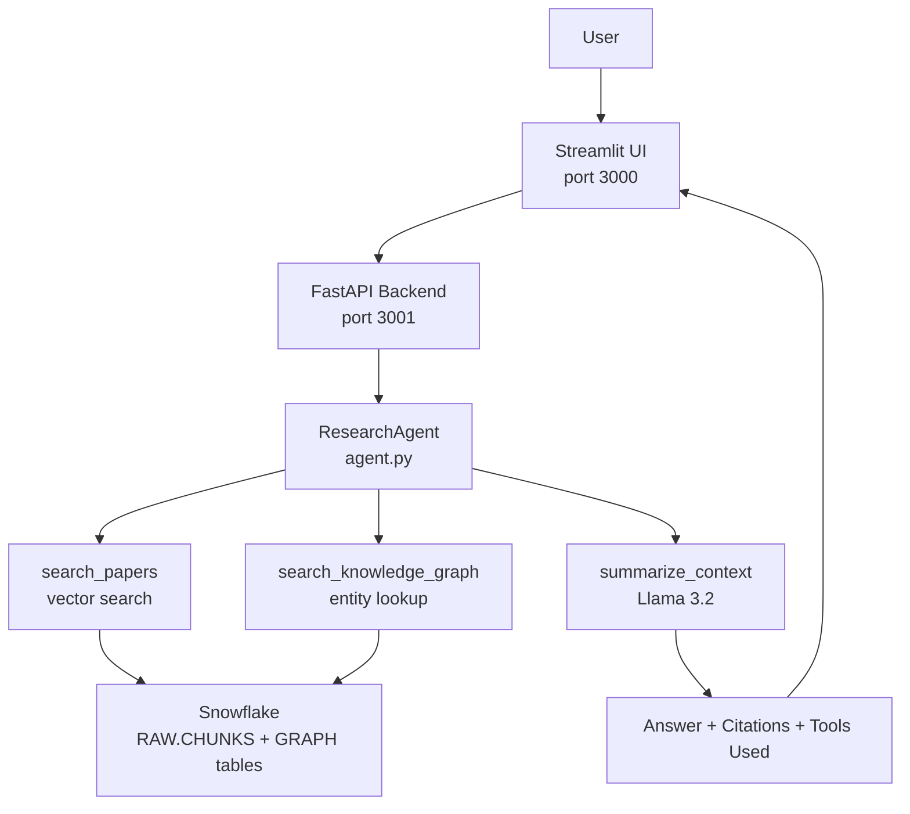

# CS 5542 – Lab 6: AI Agent Integration
### Snowflake-Centered Personalized Research Assistant

An AI agent that answers natural language questions about scientific literature using Retrieval-Augmented Generation, Knowledge Graphs, and tool-calling over a Snowflake data warehouse.

---

## Team
| Name | Role | GitHub |
|---|---|---|
| Rohan Ashraf Hashmi | Engineer 1 — Data, Ingestion & Agent | @rohanhashmi2 |
| Kenneth Kakie | Engineer 2 — Backend & Retrieval | @kenneth-github |
| Blake Simpson | Engineer 3 — Frontend & Evaluation | @blake-github |

---

## What This Does

A user asks a question like *"What are kernel methods used for?"*

The agent:
1. Searches 35,349 text chunks from 1,000 arXiv papers using vector similarity
2. Optionally queries a knowledge graph of 188,123 scientific entities
3. Feeds retrieved chunks to Llama 3.2 to generate a grounded answer with citations
4. Returns the answer, citations, tools used, and latency

---

## System Architecture



---

## Quickstart

### 1. Clone and install
```bash
git clone <repo-url>
cd cs5542-lab6
python -m venv venv
source venv/bin/activate
pip install -r requirements.txt
```

### 2. Configure .env
```bash
cp .env.example .env
```

```
SNOWFLAKE_ACCOUNT=your_account
SNOWFLAKE_USER=your_username
SNOWFLAKE_PASSWORD=your_password
SNOWFLAKE_ROLE=your_role
SNOWFLAKE_WAREHOUSE=ROHAN_BLAKE_KENNETH_WH
SNOWFLAKE_DATABASE=CS5542_PROJECT_ROHAN_BLAKE_KENNETH
SNOWFLAKE_SCHEMA=RAW
HF_TOKEN=your_huggingface_token
```

> Data is already in Snowflake. Teammates do not need to run ingestion — just configure .env and run the agent or backend directly.

### (optonal) 3. Run the agent as standalone program (CLI)
```bash
python agent.py
```
Prompts for Snowflake MFA once, pre-fetches all chunks, then accepts questions interactively.

### 4. Start backend 
```bash
uvicorn backend.app:app --reload --port 3001
```
Make sure to enter OTP

### 5. Start frontend
```bash
streamlit run frontend/app.py --server.port 3000
```

---

## Agent Tools

| Tool | Description |
|---|---|
| `search_papers` | Vector similarity search over APP.CHUNKS_V (768-dim cosine similarity) |
| `get_paper_details` | Fetch full paper metadata from RAW.PAPERS by paper_id |
| `search_knowledge_graph` | Entity + relation lookup in GRAPH tables via scispaCy NER |
| `summarize_context` | Llama 3.2 generates grounded answer from retrieved chunks with citations |

### Example Session
```
You: What are kernel methods used for?

[Agent] Iteration 1...
  [Tool] Calling search_papers(['query', 'top_k'])
  [Tool] search_papers → top score: 0.7764
[Agent] Calling summarize_context with retrieved chunks...
[Agent] Done in 9392ms | Tools used: ['search_papers', 'summarize_context']

Answer:
Kernel methods are used for classification, regression,
and model selection [1].

Citations (5):
  [1] arXiv Paper arxiv_000101 | body | score=0.776
  [2] arXiv Paper arxiv_000101 | body | score=0.706
```

### Suggested Queries
- "What are kernel methods used for?"
- "What concepts are related to regression?"
- "How do additive models reduce dimensionality?"
- "What is a reproducing kernel Hilbert space?"
- "What methods are used for quantile regression?"

---

## Project Structure
```
CS_5542_LAB_6/
├── agent.py                       # ResearchAgent + CLI mode
├── tools.py                       # 4 agent-callable tool functions
├── tool_schemas.py                # OpenAI-compatible schemas + TOOL_FUNCTIONS
├── task1_antigravity_report.md    # Cursor IDE analysis report
├── task4_evaluation_report.md     # Agent evaluation scenarios (Kenneth)
├── data/
│   ├── config.py                  # Central config
│   └── ingestion.py               # 6-stage Snowflake ingestion pipeline
├── scripts/
│   ├── sf_connect.py              # Snowflake MFA-aware connection
│   └── run_sql_file.py            # SQL file runner
├── sql/
│   └── 01_create_schema.sql       # Full Snowflake schema
├── backend/
│   ├── app.py                     # FastAPI (port 3001)
│   └── retrieval.py               # Vector + graph retrieval
├── frontend/
│   └── app.py                     # Streamlit agent chat UI (port 3000)
├── evaluation/
│   └── evaluate.py                # Evaluation harness
├── docs/
│   └── cursor_screenshot.png      # Cursor IDE screenshot
├── requirements.txt
├── .env.example
├── CONTRIBUTIONS.md
├── TEAM_PLAN.md
└── README.md
```

---

## Ingestion Pipeline

| Stage | Output |
|---|---|
| 1. Load | 1,000 arXiv papers, cleaned text |
| 2. Chunk | 35,349 chunks (200 words, 30 word overlap) |
| 3. Embed | 768-dim vectors (all-mpnet-base-v2, L2-normalized) |
| 4. KG Extract | 188,123 entities, 25M+ CO_OCCURS edges |
| 5. Upload | All Snowflake tables populated |
| 6. Verify | Row count validation |

To re-run ingestion from scratch:
```bash
python data/ingestion.py
# ~1 hour for 1,000 papers
# Prompts for MFA before Snowflake upload
```

---

## Demo Video

*Link to be added — see task4_evaluation_report.md for evaluation scenarios*

---

## Individual Contributions

See [CONTRIBUTIONS.md](CONTRIBUTIONS.md) for full breakdown.
