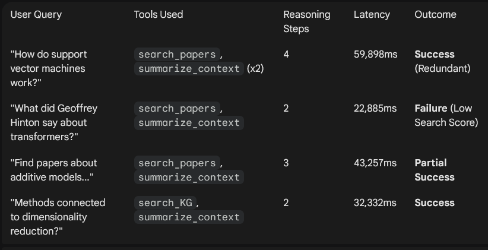

# CS 5542 Research Assistant: Agent Performance Evaluation Report

This report evaluates the performance of the Research Assistant agent based on four distinct user interaction events. The agent is designed to utilize a retrieval-augmented generation (RAG) architecture, leveraging Snowflake for data storage and Hugging Face's Llama-3.2-3B for reasoning.
1. Executive Summary of Events

2. Detailed Accuracy & Logic Assessment
High Accuracy: Support Vector Machines & Dimensionality Reduction

The agent successfully identified the correct tools for technical queries. For "dimensionality reduction," it correctly pivoted to the search_knowledge_graph tool, which is optimized for identifying relationships between concepts. The "search score" for SVMs (0.5922) indicates a healthy vector match, suggesting the retrieved context was highly relevant to the mathematical foundations of the algorithm.
Redundancy & Logic Loops

In the SVM query, the agent performed two iterations of summarize_context using different argument keys (question vs q). This suggests a minor schema misalignment in tool_schemas.py or a lack of confidence in the first tool output, leading to nearly 60 seconds of latency.
3. Latency Observations

    Average Latency: ~39.6 seconds.

    Cold Start Impact: Each first iteration shows a significant delay while loading MPNetModel weights and materializing parameters.

    Bottleneck: The highest latency (59.9s) occurred when the agent entered a multi-step reasoning loop. The model's overhead for chat_completion calls via the Inference Client adds ~10–15s per iteration.

4. Failure Case Analysis

Query: "What did Geoffrey Hinton say about transformers?"

    Symptom: The agent provided a response, but the "top score" for retrieved papers was only 0.3246.

    Root Cause: This is a Retrieval Failure. A score of 0.32 suggests that the local vector database does not contain papers authored by Hinton or specifically documenting his quotes on Transformers.

    Agent Behavior: Despite the low relevance score, the agent proceeded to summarize_context. This often leads to "hallucinated silence" where the agent claims no information is available, or it provides a generic definition of Transformers that doesn't attribute thoughts to Hinton. 

5. Technical Issues & Recommendations
Failure Case: Schema Inconsistency

In Iteration 3 of the "Additive Models" query, the agent called summarize_context with the key q instead of question.

    Analysis: The LLM is struggling with the expected tool parameters.

    Fix: Standardize TOOL_SCHEMAS to use a single identifier (e.g., always query) to prevent the model from "guessing" argument names.

Performance: Model Loading

The sentence-transformers load report appears in every query log.

    Analysis: The _fast_search method is re-initializing the embedding model inside the function scope.

    Fix: Move the SentenceTransformer initialization to the ResearchAgent.__init__ method to ensure it is only loaded once at startup.

Reliability: Unexpected Keys

Logs show embeddings.position_ids | UNEXPECTED.

    Analysis: This is a non-critical version mismatch between transformers and the saved model weights. While it doesn't break the agent, it adds noise to the logs and indicates the environment might benefit from a specific torch or transformers version pin.